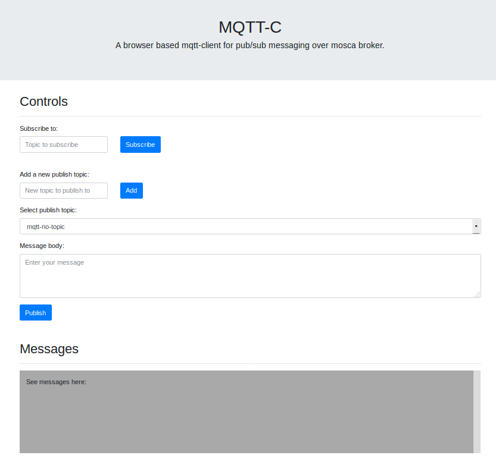

## Interactive demo for understanding MQTT

We will be using [**node-mqtt**](https://github.com/manjrekarom/node-mqtt) which is an application that uses MQTT for communication. It uses Mosca MQTT broker and MQTT.js in browser, and communicates with MQTT over Websockets protocol. 

You can clone the [**node-mqtt**](https://github.com/manjrekarom/node-mqtt) repository yourself if you wish to try it out. Instructions for installing the application and its dependencies are given in its respective [repository](https://github.com/manjrekarom/node-mqtt).
&nbsp;

node-mqtt UI
-----
This is the UI for the application. 
1. You can add the topic (any topic) to subscribe to it. 
2. Similarly, you can insert a topic to publish a message on it. After you add a topic, use the dropdown to select the topic and write the message in the message box.
3. You should see the messages that are being received on specific topics in the message window.
4. You can also use MQTT wildcards.

