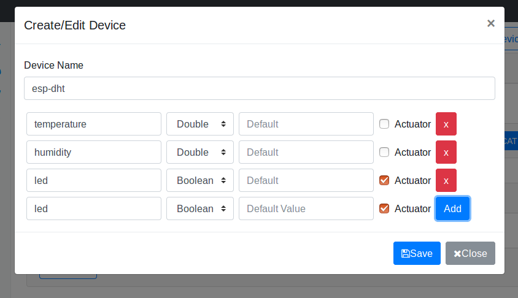
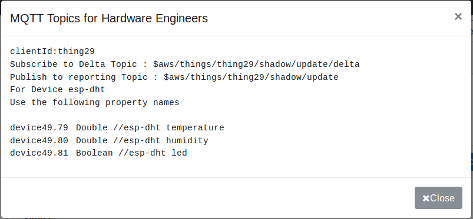

# A NodeJS app on Raspberry Pi that sends and receives arbitrary data to AWS IoT

## Overview
This is a project to send arbitrary data to AWS IoT. It publishes data to thing shadow service in AWS IoT.

## Steps:
 1. Login to IoT dashboard available in following [link](http://iot.e-yantra.com) with the provided user id and password
 2. Create a thing in the dashboard 
 3. Create devices under thing as:
     * Temperature, double
     * Humidity, double

 1. Download certificates and keep them in a separate folder
 2. View the thing properties by clicking GENERATE CLIENT button in dashboard. 

Note the clientID and deviceXX.XX in the pop-up. In later instruction these will be needed in the code.
 1. Create a new folder for your project named **nodejs-test**. **All the steps you do after this are done inside the created folder.**
 2. In the *codes* folder inside this github repository, you'll find test.js (or see [this](https://github.com/sanamshakya/interfacing-AWS-IoT/blob/master/RPi/test-js/)). You have to copy this file to the **nodejs-test** folder.
 3. Run command "npm init" and fill the fields you require (optionally, you can also skip through all of them).
 4. Run command "npm install aws-iot-device-sdk --save".
 5. Copy downloaded files: certificate.crt.pem, private.key.pem, public.key.pem and rootCA.pem in the folder
 6. Edit test.js file by replacing " " with the required values according to thing settings found in step 5.
 7. For now we will supply arbitrary values to iot platform. For it, we will replace fields enclosed in "< >" by integers or doubles ( e.g. <device-attribute> becomes 19 and so on).
 8.  In terminal go to **nodejs-test** folder and run command "node test.js" to start the app.
 9.  Go to dashboard, check if values are updated. 
