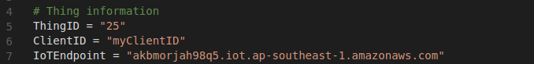
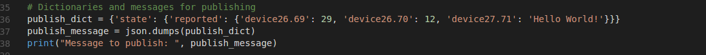

## Connecting devices to IoT platform with python

You will learn to connect your device, that supports python, to IoT Platform(~AWS IoT). 

We will be using one of the popular devices out there which is Raspberry Pi. But please note that the procedure is 

going to remain the same as long as you are using Python.

**NOTE:** We will need some files and information before hand like certificate pairs, thingID, etc. This becomes available only after you create a thing in IoT Platform.

For instructions on how to do it please see [*Using IoT Platform*](../../using-iot-platform).

Lets get started:
-----
1. Create a folder that will hold all your project files. We will name it `iot-app`
2. `cd iot-app` and paste all **4 certificate related files inside** it in **a folder named "certificates"** namely, *private.key.pem, public.key.pem, certificate.crt.pem and rootCA.pem*.
3. Next you have to download the file [*simple-pubsub.py*](./codes/simple-pubsub.py). You can either copy paste the contents of this file or clone the full repository.
4. Copy this file into `iot-app` folder.
5. Create a thing in IoT Platform [or see this](../../using-iot-platform/1-creating-organizational-units.md). The thing should have 3 devices with following deviceAttributes in the devices you created:
    1. Device1 with: 
        1. DeviceAttribute1 of type Integer.
        2. DeviceAttribute2 of type Double.
    2. Device2 with DeviceAttribute1 of type String.
    **NOTE:** Make sure you **don't tick the actuator checkbox**.
6. Open the file and change these settings to what you can find on your thing's **generate client** tab.

7. Also edit the **"deviceXY.ZW" to the "deviceAB.CD"** that you find in **device-shadow JSON** in the **generate client** tab. You can find it in publish_dict dictionary.

7. We have used aws-iot-device-sdk for python. It is acts as an MQTT(among other things) and allows you to connect to AWS IoT broker. It might not be installed on your device so to install it run `pip install aws-iot-device-sdk`.
8. If the above command succeeded then your device is ready to publish information. Run `python simple-pubsub.py`.
9. Go to the dashboard tab and see if it's showing the data you published.

*Congrats, you have successfully created your very first IoT application!* 
