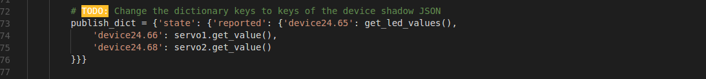

## Controlling servos and LEDs on 5-day-workshop kit with IoT

We will be interfacing the 5-day-workshop kit with IoT Platform. With this we will be able to control the hardware mounted on the kit, like servos, LEDs and also read sensor data, from IoT Platform or even mobile devices using IoT Platform REST Api.

The Kit
-----

Lets get started
-----
1. Download or clone this repo and change directory to the `iot-workshop/iot-platform/projects/python/Controlling 5-day-workshop kit with IoT` folder (You can either do it on your Rpi directly or you can move the project files after modifying them on your computer).
2. Next go ahead and create a thing for this Rpi in IoT Platform. You have to create 4 devices:
    1. ServoH: Should have one **integer** device attribute which **needs to be an actuator.**
    2. ServoV: Should have one **integer** device attribute which **needs to be an actuator.**
    3. LED: Should have one **string** device attribute which **needs to be an actuator too.**
    4. DHT: It should have two device attributes.
        1. Temperature: Should have one **double** device attribute which is **NOT an actuator.**
        2. Humidity: Should have one **double** device attribute which is **NOT an actuator.**
    [Check this to know more about how you can do it](../../using-iot-platform/1-creating-organizational-units.md).

3. Once that is done and your thing is created, you should download certificates for it and put them in certificates folder under projects.
4. Next open [*control_rpi.py*](./control_rpi.py) file using a text editor and change below settings to what you can find on "generate client" tab.
    1. Thing settings 
    
    1. Dictionary settings
    
    1. Device settings
    
    
    
    **NOTE:** Also take a **look at all the TODOs.** You might not need to change everything but make changes where necessary.
5. Our program uses *aws-iot-device-sdk* for python for connecting with AWS IoT. To install it do `pip install aws-iot-device-sdk`. 
6. Run this python program. If it gives you no error your client is set.
7. Go to IoT Platform, select the thing you created and click on dashboard button.
8.  You should see controls for controlling the hardware on Rpi.
9.  Change values on the controls to see the servos and LEDs actuating.

*If you got it to work, congrats. Raise your ✋ and pat your back.*
