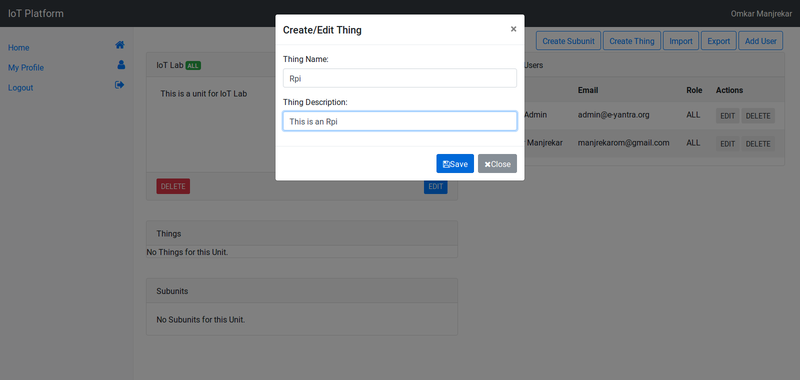

## Using e-Yantra IoT Platform

In this tutorial you will learn to create organizational units in e-Yantra IoT Platform.

When you are creating IoT projects you might want to divide the things into groups so that you can manage them better. IoT platform realizes this use case and provides various organisational units for you to use.

There are 4 main organizational units as such as:
1. **Units**
    
    Units can contain other units and things.

2. **Things**

    Things repersent your micro-controllers which will be connected to internet and send/recv data. A thing can have one or more devices.

3. **Devices**

    Devices are sensors that you connect to a thing example a DHT sensor to measure temperature or humidity. A device can have one or more device attributes.

4. **Device Attributes**

    Device attributes are the quantities a sensor measures. It can be more than one like in DHT, it is temperature as well as humidity. It has a type which is one of Boolean, Integer, String, Double. You can choose to make it either actuator or sensor.

You can create, read, update or delete each of these. We will be seeing how to do that with an example.

Goal
----
To create a unit "IoT Lab" with a single thing "Rpi" with two devices "LED" and "DHT". 
"LED" will have a single device attribute of type boolean. "DHT" will have two attributes, temperature and humidity one integer and another double.

Lets get started:
----
1. Login to [**e-Yantra IoT Platform**](http://iot.e-yantra.com) using the user ID and password provided to you (if you have set that up [**locally**](http://github.com/E-yantra/iot-platform), you can visit localhost on default port 8002).
2. Once you login you will see the Units that have been assigned to you like below.

3. Click on the **manage** button.
4. You can create a unit inside this unit (if you have **ALL** permissions).

5. Go ahead and click on **Create Subunit**. You will see a dialog box. Fill in the details as shown below and click on save.

6. If you successfully created your unit, you will see **IoT Lab** in the **Subunits section**.

7. Click to open it and you will be inside the unit.

8. Next find the **Create Thing** button on top and fill in the details like below.

9. Once done, click on save. If it was successfully created you can find the **Rpi** in **Things section**.

10. Open it and you'll see similar to below screen.

11. Next click the **Add Device** button on top and fill the details like below. Remember you have to create two devices, LED and Rpi. Click save after filling the data about devices.

12. You should find the **saved devices** like below.

13. You can now **download certificates** and see the **information about the thing in generate client tab** which you can use to send data. 
14. Go ahead and try downloading device certificates either as **zip** or **popups**. You will find 3 files:
    1. *private.key.pem, public.key.pem, certificate.crt.pem* (all three included in zip).
    2. *rootCA.pem* (you should download this seperately).
15. You'll find similar information under your **generate client tab**.

*That is all there is to it. This was the first tutorial in the series on **using IoT platform**. You should use these building blocks to structure your IoT project, to group **things** in a way that makes most sense.*

Next you should check out other individual tutorials on features available in IoT Platform or the [**complete guide**](./iot-dashboard.pdf "IoT Dashboard Pdf").
