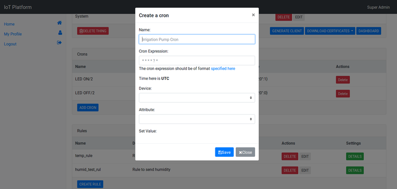
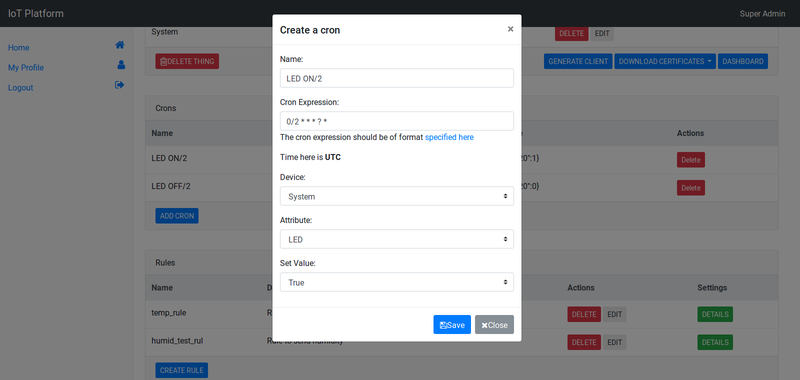

## Creating Crons

Crons are commands to be executed at a specified time. In IoT Platform, we can setup crons to trigger actuator actions at specified times. For example, if you have an irrigation pump that needs to turn on at 5am everyday and turn of at 5:30am, you can do that using cron rules. For this exact use case, you will write two crons, one to turn on and another one to turn it off. The time and frequencies of scheduling are written using cron expressions. 

Prerequisites
-----
1. Creating organizational units with actuators in IoT Platform.
2. Connecting a thing (micro-controllers, connected devices) to IoT Platform and make it trigger actions (like LED on/off, etc).

Steps
-----
1. Login to *e-Yantra IoT Platform*.
2. Select the *thing* you wish to create a cron on.
3. This is the cron section. You can see created crons down here, if any.

4. Click on the *Add Cron* button.
5. You will see the below modal. Following are the explanations for its fields:
    1. **Name** is the identifier you can give to your cron rule.
    2. **Cron Expression** is the format to write your cron. It is derived from the way you write cron in *NIX operating systems.
    3. **Device** is the device whose actuator you want to schedule (like an AC is a device).
    4. **Attribute** is the actuator attribute of the device you want to control (under an AC there can be many actuators for temperature, fan-speed, etc).
    5. **Set Value** is a field to set value of the actuator when the cron rule executes.
    
6. We will write a simple cron rule that turns on the LED on your device every two minutes starting right now and another one after some time to turn the LED off every two minutes. Fill in the details as shown below.

8. Save the rules and that's it.

Learning to write cron expressions on your own will take time and practise. You can see this [guide](http://docs.aws.amazon.com/AmazonCloudWatch/latest/events/ScheduledEvents.html#CronExpressions) on writing crons for more flexible cron expressions.
