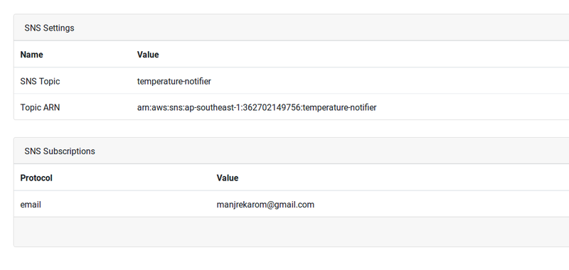

## Writing notification rules

Notification rules allow devices to send a notification on a certain trigger condition. You have the option to specify any trigger condition that you may like. 

For example, you might want to be notified if temperature on your sensor goes above some X degrees. You can create an SNS rule with the condition for temperature greater than X and message you want to send. You can also add subscribers by email, sms*, etc. to receive this notification. 

Prerequisites
-----
1. Creating [organizational units](./1-creating-organizational-units.md) with actuators in IoT Platform.
2. [Connecting a thing](../connecting-devices-to-platform/python/1-connecting-devices-to-platform-python.md) (micro-controllers, connected devices) to IoT Platform and make it trigger actions (like LED on/off, etc).

Steps
-----
1. Login to *e-Yantra IoT Platform*.
2. Select the *thing* you wish to create a notification rule on.
3. Find the *Rules section* and click on *Create rule* button.

4. You will see a modal like below. Following are the fields:
    1. **Name** is the name of your rule. It CANNOT BE SPACE SEPERATED. You should use hypens or underscores if you inted to create multi-word string.
    2. **Description** is the description of what your rule does.
    3. **Data** is how much of your data from the device should be used for making decisions and sending. If you want to select all the data, you can use "*" for ALL.
    4. **Condition** is trigger condition on which the rule executes the action (in our case sends an email/sms). You can only put condition on any of the fields filtered due by data parameter.
    
5. We will create a rule named Temperature rule. Fill the values like shown below.
    **Note:** We have to use [*get*](https://docs.aws.amazon.com/iot/latest/developerguide/iot-sql-functions.html#iot-sql-function-get) method to fetch value from device shadow of the temperature field. You should use *generate client* window to find out which field represents temperature values.
    
6. Select *SNS* in Type and fill the details like below. Following are what the fields mean:
    1. **SNS Topic** on which you want to publish this message. It CANNOT BE SPACE SEPERATED. You should use hypens or underscores if you inted to create multi-word string.
    2. **Subject** for notifications that *support subject field* like emails.
    3. **Message** to send as a payload in emails/sms.
    4. **Interval** is minimum time before another notification is sent.

7. Save your rule and that's it. The rule has been created but there are no subscribers for your rule.
8. Click on the details button on the rule and you would see this window. It shows you subscription details:
    
    **Note:** If you have not added any subscriptions yet you would be presented with "no subcriptions" message. In my case, I had created one already.
9. Select *add subscription* and the details like below. In the protocol, type "email" and use your email ID as "endpoint".
10. Click save and you'll see the email ID you used, in the table below.
11. You should check your email inbox for a subscription email from AWS. Once you confirm, you will start receiving messages. 